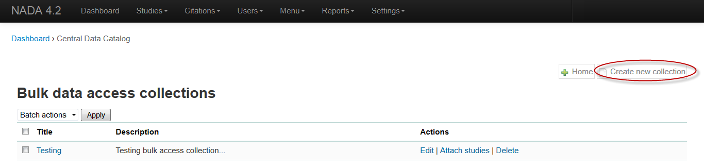
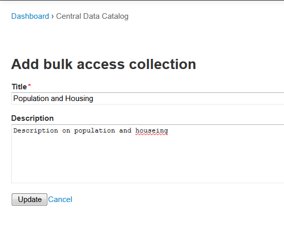
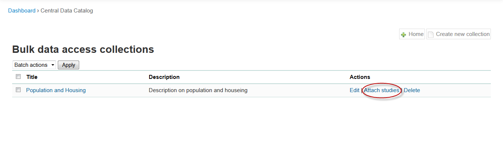
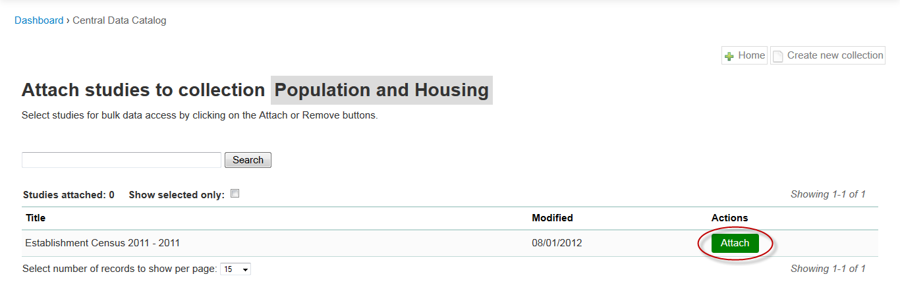
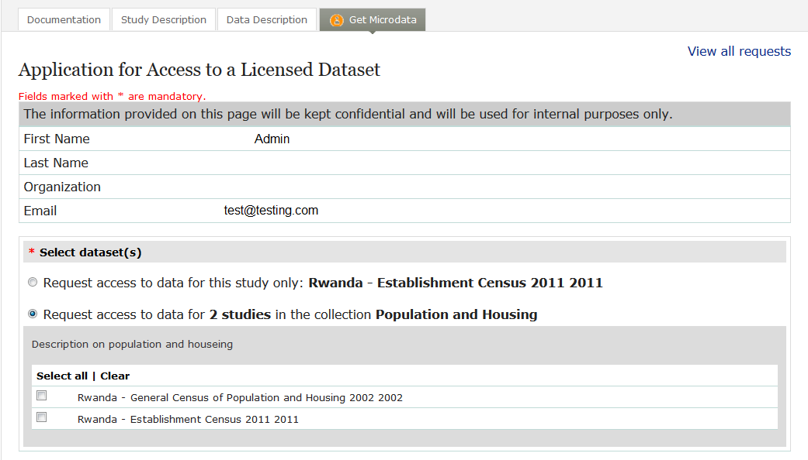

================
Adding Bulk Collection in NADA 4.2
================

Follow the following steps to add new bulk collection:

A.	Login to NADA 4.2 as administrator
B.	Go to Studies  - Bulk Access Collection
C.	Click on “Create new collection”

D.	Add title and description for your new bulk collection shown as below

E.	Click on update

F.	You will find below screen after creating new bulk collection

G.	Click on “Attach Studies”

.. note::		
	You can only attached studies having “License Data Access” type. Please make sure that study must be belongs to at least one collection

H.	Click on attached button for the studies you want to attach to this collection as shown as below:
 

I. User will be able to request multiple survey datasets with single request

