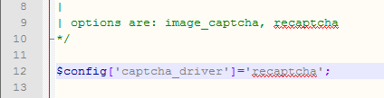
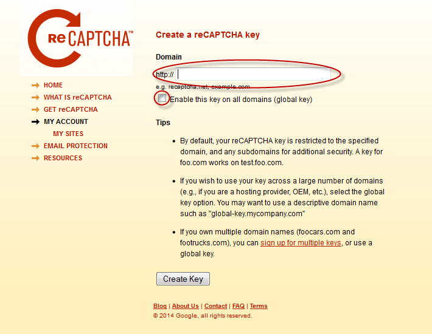
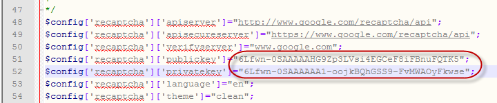
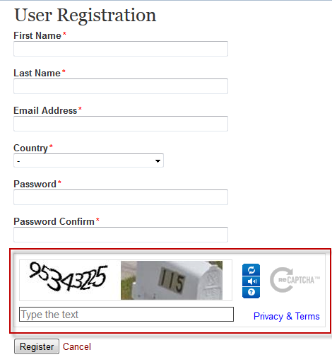

============
Configure Captcha
============

By default NADA version 4.1 comes with image captcha and user does not need to make any changes to use image captcha. To use Google Captcha please follow the steps given below:

A.	Open application/config/captcha.php in editor 

B.	Change line number 12 as shown in below image

C.	Click on above URL to generate Public and Private key URL: http://www.google.com/recaptcha/whyrecaptcha

D.	Click on sign up now 

E.	Sign in using your Gmail account

F.	After signed in you will have to enter your URL (Domain URL)

 
G.	Click on “enable globel key for all domain

H.	Click on Create Key button

I.	Copy public key and private key from Google Captcha website and inserte it on line number 51 and 52 respectively as shown in below image

 
J.	To check the Google catpcha configuration go to register page and look for image as shown in below URL highlighted in Red suqare

