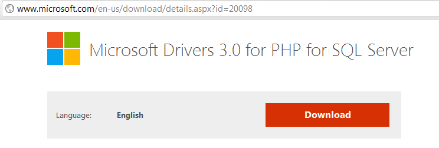
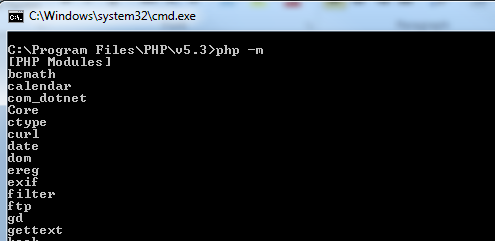

==========
NADA Installation and Configurations for IIS
==========

This document covers the steps to install NADA on IIS 7/8 and using the rewrite module to secure access to NADA files and folders.

Microsoft SQL Server Client
-----------

This is only needed if you want to use Microsoft SQL Server with NADA. If you are using MySQL then you can skip this step.

Download and install the SQL Server Client from here: http://www.microsoft.com/en-us/download/confirmation.aspx?id=16978

**Microsoft® SQL Server® 2008 R2 Native Client**

*Microsoft SQL Server 2008 R2 Native Client (SQL Server Native Client) is a single dynamic-link library (DLL) containing both the SQL OLE DB provider and SQL ODBC driver. It contains run-time support for applications using native-code APIs (ODBC, OLE DB and ADO) to connect to Microsoft SQL Server 2000, 2005, or 2008. SQL Server Native Client should be used to create new applications or enhance existing applications that need to take advantage of new SQL Server 2008 R2 features. This redistributable installer for SQL Server Native Client installs the client components needed during run time to take advantage of new SQL Server 2008 R2 features, and optionally installs the header files needed to develop an application that uses the SQL Server Native Client API.*

Audience(s): **Customer, Partner, Developer**

**X86 Package** (sqlncli.msi)

**X64 Package** (sqlncli.msi) [http://go.microsoft.com/fwlink/?LinkID=188401&clcid=0x409]

**IA64 Package** (sqlncli.msi)

Install PHP Manager for IIS 7/8
-------------

The PHP manager makes it easy to install and configure PHP on IIS and you can configure various versions of PHP on your server and control which version of PHP to use for each web application.
Download and Install from here: http://phpmanager.codeplex.com/releases/view/69115
The direct link to download the manager for 64bit windows is: http://phpmanager.codeplex.com/downloads/get/253209

.. Note:: The PHP Manager works with both IIS 7 and 8 so if you are on IIS 8 it should work.
 

Installing PHP 5.3/5.4/5.5
---------------

1.	Download PHP 5.3 or later from here: http://windows.php.net/download/. 
2.	Make sure you download  Non-Thread-Safe version if you are planning on using the Microsoft SQL Server Database.

3.	Create a folder C:\\PHP
4.	Create a subfolder C:\\PHP\\v5.3
5.	Unzip PHP 5.4 contents to C:\\PHP\\v5.3
6.	Open IIS and launch PHP Manager. Click on the machine name instead of “Sites” to configure PHP for the whole server.  

7.	Under PHP Manager, look for the option to register new version of PHP and it will ask you to select the PHP executable file.

8.	For PHP executable, select the php-cgi.exe form the c:\\PHP\\v5.3 folder
9.	To test PHP is installed, go to the PHP Manager and you will see the link to “Check phpinfo()”. Click on the link and it will ask you for which website you want to run the phpinfo, from the drop down select the website and if PHP is configured properly you will see the PHPINFO page displayed.
10.	To enable xls php extensions or any other extension, see the section PHP Extensions on the PHP Manager.

11.	Look for xls.dll
12.	Click on it and you will be able to see enable / disable section in right side of the iis manager

13.	To change PHP settings such as file upload size and etc, use the link “Manage all settings” and update values as needed.

Install PHP SQLSRV drivers/extension
---------------------------

This is needed for PHP to connect to Microsoft SQL Server. The drivers can be downloaded from here: http://www.microsoft.com/en-us/download/details.aspx?id=20098

1.	Click on the red download link.

2.	Click on the download will open the screen below to ask you which version you want. If you are running on PHP 5.3 then choose SQLSRV20.EXE.

3.	The installer does not install anything and merely unzip the contents. When you run the executable, it will ask for a folder name, extract the files to c:\\PHP\\v5.3\\ext folder.

4.	To enable the extension, go back to IIS,  and open PHP Manager and under the heading “PHP extensions” you will see a link to enable or disable extensions. Opening the list will show you all the available extensions, just look for the extension that has the keywords “SQLSRV”, “NTS” and “5.3” in it and enable it.

5.	Run the “check phpinfo()” from PHP Manager and make sure you can see the SQLSRV extension listed on the phpinfo page. 

6.	If you don’t see the SQLSRV listed then the extension is not installed. Go back to step 4 and make sure you have enabled the correct file. If everything looks right and you still can’t enable the extension then go to the command line and change folder to where PHP is installed and run this command and it will tell if you something is wrong with your configurations.

From command line run: php -m

Install IIS URL rewrite extension
-------------

Please download from here and install: http://www.iis.net/downloads/microsoft/url-rewrite

Create or update web.config in the NADA root folder and paste the following content:

.. code::

		<?xml version="1.0" encoding="UTF-8"?>
		<configuration>
			<system.webServer>
			<rewrite>
			<rules>
				<rule name="allowed files"  stopProcessing="true">
					<match url="index.php|test.php" />
					<action type="None" />
				</rule>
				<rule name="Rewrite CI Index">
					<match url=".*" />
						<conditions>
						<add input="{REQUEST_FILENAME}" pattern="css|js|jpg|jpeg|png|gif|ico|htm|html|swf" negate="true" />
						</conditions>
					<action type="Rewrite" url="index.php/{R:0}" />
				</rule>
			</rules>
			</rewrite>
			</system.webServer>
		</configuration>

The web.config includes the rewrite rules to prevent access to files in NADA other than the main index.php file and allows access to images, css and html files only. 

To test that the rewrite rules are working as expected. Try to open a URl such as http://[nada]/application/config/config.php file. If you see you have been redirected to 404 page with the nada header and footer then you have successfully configured the rewrite module.

