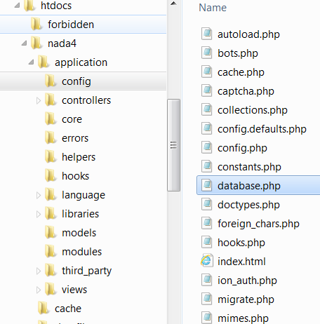
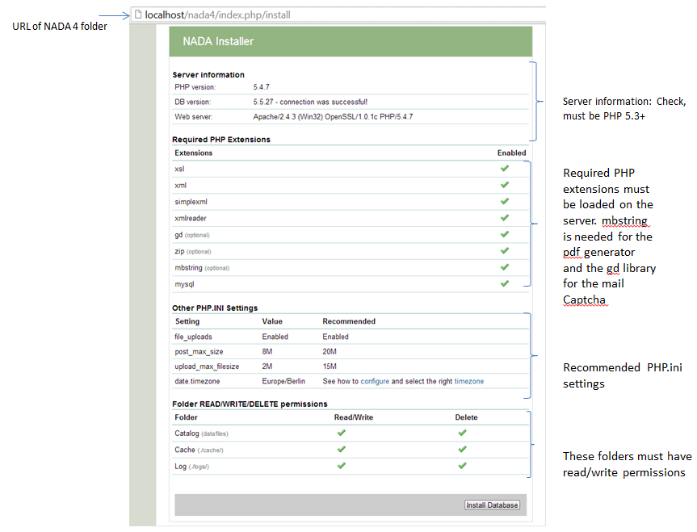
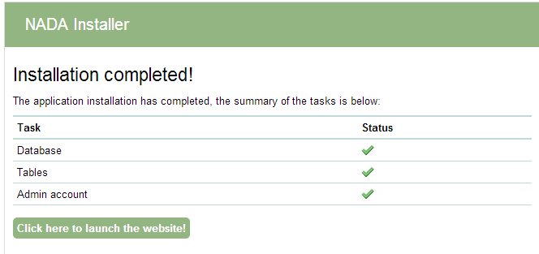

Installation
############

Download the latest NADA
=========================

* Download a copy of the NADA 4 software from the IHSN: http://ihsn.org/nada

* Open and extract (unzip) the files to your local hard drive using an appropriate compression program. If you do not already have such a compression program there are many open source compression programs available. For Windows use the built-in compression software wizard or alternatively the 7-ZIP File Manager which is a free compression program. On Linux systems the same tasks can be achieved from the command line, or once again, through the use of a separate program. Mac OSX has a number of options - third party, and built-in, as well as from the command line.

Setup application folder
=========================

* Copy the files to a folder in the web server root folder. If installing on a localhost - for example the computer currently being working on – then copy and paste (or move) the files into the root folder (or a sub-folder) of the web server. If, however, the server is running on a remote host (such as an ISP), then this process will involve the use of a FTP client program or file manager from the ISP’s Cpanel.

.. note::

	The folder name chosen will in many cases become the URL for the catalog. Examples for a folder name might be – data, microdata, catalog etc.

* The root folder is located in different places depending upon the operating system/distribution and web server package you are using and it might be called htdocs, httpd, or www. On Windows servers this might be located in the inetpub directory and on Linux in the /var directory. Consult the documentation for the distribution being used or contact the ISP if unsure where the root web folder is.

Folder permissions
===================

Change the permissions for the following folders and their contents to **READ/WRITE** and on Windows servers make sure the **IUSR_** user has **read/write/delete** permissions on these folders:

* **your-nada-web-folder/datafiles** – this is the folder where the application will store the DDI‘s, documentation and data.

.. note::

	For added security, it is strongly recommended that the location of the datafiles directory be changed after installation to a location outside your web root structure.

	
* **your-nada-web-folder/cache** – this is where cached web pages will be stored
* **your-nada-web-folder/logs** – this is where the log files will be stored

Configure MySQL database
====================

#. Browse to the **your-nada-web-folder/application/config** folder.

#. Open the **database.php** file in a text editor like Notepad or Notepad ++, and change the database user name and password to match the database user name and password. 
#. Optional: change the database name to use another name. 
#. Save the file.

::

	$db['default']['username'] = "your-database-username";
	$db['default']['password'] = "your-database-password";
	$db['default']['database'] = "nada4"

.. note::
	
	Do NOT use the root username and password (MySQL) or SA Account (MSSQL) on your production server. Create a separate user name and password for your NADA database. This can be done either from your Cpanel or from PhpMyadmin, MySQL Workbench.

Create database user account
=============================

The goal being to avoid using Root for your NADA configuration. 

1. From the command line type: ::

	mysql -u root –p 

2. Enter your root password you setup when installing MySQL. 
3. Now create a database for the NADA – in this example we call the database nada ::

	mysql> CREATE DATABASE nada; 

4. Now create a user who can access the new nada database and give the user only the rights necessary to run the NADA. ::

	mysql> GRANT SELECT, INSERT, UPDATE, DELETE, CREATE, DROP, INDEX, ALTER, CREATE TEMPORARY TABLES,LOCK TABLES ON nada.* TO 'nada'@'localhost' IDENTIFIED BY 'yourpassword'; 

5. 'yourpassword' can be anything you choose. 'nada' is the name of the database the user gets access to. 'localhost' is the location which gets access to your database.

.. note::

	Remember this password, you will need it to configure your NADA installer! 

6. Then exit MySQL console by typing exit. ::

	mysql> exit

Running the installer
==========================

Open web browser to the location of the NADA installation. For example: http://your-domain/nada-folder-name, or localhost/nada-folder-name.

Check that all settings are marked with a green tick and fix any that are not on your webserver before running the installer.

Click on the Install Database button and complete the form to create an initial Site Administrator account.

.. note::

	create a complex password at least 12 characters long with some uppercase, punctuation and numbers to aid security of your site. Do not forget this username and password!

.. image:: images/admin-account-image.png
	
**Congratulations: Launch the new site**

 

