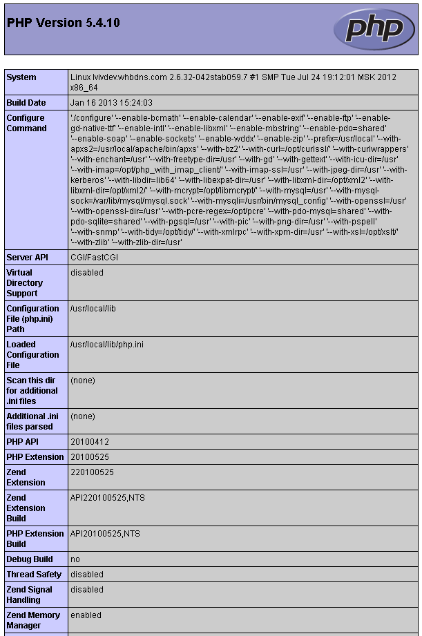

============
PHP settings
============

Finding the correct PHP.INI
-----------------------------

To make sure you are editing the correct PHP.INI settings file, create a PHP file (e.g. info.php) in your nada website folder with the following contents: ::

	<?php phpinfo(); ?>

Open the phpinfo page in your web browser and you should see output similar to below screenshot. Edit the php.ini file displayed by the setting **Loaded Configuration File**.

File upload limits
-----------------------------

By default PHP allows uploads of 2MB which could be a problem if you have large DDIs and external resource files. To change the settings:

1. Edit the php.ini file in notepad and look for the setting **upload_max_filesize**

2. The line should look like: ::

	; Maximum allowed size for uploaded files.
	; http://php.net/upload-max-filesize
	upload_max_filesize = 2M

3. Change it to the required file upload limit per your needs ::

	upload_max_filesize = 50M

4. There is another setting that MUST be changed as well for the file upload limits to work. Look for the configuration **post_max_size** and change it to match the value for upload_max_filesize: ::

	post_max_size = 50M

TimeZone settings
-------------------------------------

This is for setting the timezone for your application. To findout what is the correct timezone for your website, go to http://php.net/manual/en/timezones.php and find your country/city. 

Example::

	date.timezone = "America/New_York"

Increase page execution/timeout
--------------------------------

This setting controls the maximum execution time of a page in seconds.  ::

	max_execution_time = 300

Increase PHP memory limit
----------------------------

It controls the memory available to PHP scripts. ::

	memory_limit = 128M

Enable/disable PHP extensions
-----------------------------

NADA requires the following PHP extensions:

* xsl
* mbstring
* mysql or sqlsrv

To enable XSL extension, add this line: ::

	extension=php_xsl.dll

To enable mbstring: ::

	extension=php_mbstring.dll

