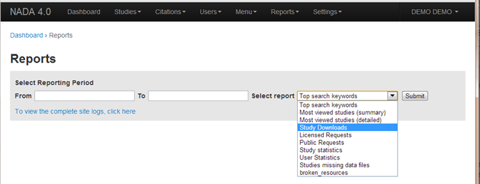
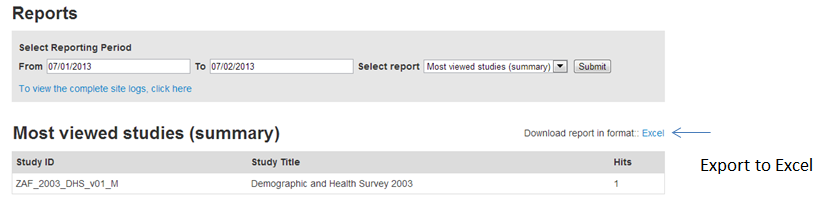

============
Generating Reports
============
The NADA has a built in reporting function. To access statistics on downloads number of users, data requests, study views, top keywords used in searches etc. Click on the Reports – All Reports menu on the top menu bar of the Site Administration.

*	Select the time period for which the generate the report and select the type of report from the dropdown box.

*	All study reports may be exported to Excel.

 

