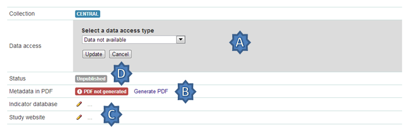

=================
Uploading Studies
=================

Files needed to upload a study include:

* A DDI 2.x xml file containing the study metadata.
* The IHSN recommends the freeware Nesstar Publisher for preparing the DDI document. The program may be obtained from http://www.nesstar.com. 
* For further references in preparing a DDI compliant metadata document see: http://ihsn.org/HOME/software/ddi-metadata-editor
* As well as the Quick Reference Guide for Data Archivists: http://ihsn.org/HOME/sites/default/files/resources/DDI_IHSN_Checklist_OD_06152007.pdf
* A Dublin Core , resource description file (RDF) – see the above programs and links for preparing an RDF file.
* Any documents such a questionnaires, reports and technical documents to be shared
* Any data files that are to be shared
* The URL’s to any external sites that might be linked to from the study page.

* From the Manage Studies link select the collection to which the study will be uploaded. Only one Collection exists in the default NADA4 installation. The Central Data Catalog.

**Uploading a DDI**

* To add a new study: Click on the Add Study link in the top right (A)

* Select the location of your DDI and RDF files for the study to be uploaded.

* Select the Overwrite button if updating an existing study with the same ID. Click submit
.. note::

	It is possible to upload more than one study at once using the “Bulk import DDI” link next to the “Add study” button. Simply select the DDI’s you want to upload and follow the dialogue instructions. This is useful when you have many DDI’s load and want to do it all in one step. 

The Study edit page loads. 

A.	Tells the administrator that this study has not been published yet and that the documentation in PDF format for this study has not been generated.

B.	Is where Files (Questionnaires, reports and data) are uploaded, resource descriptions are added, citations and notes are added

C.	From this area a study can be published, a data access type set, a pdf metadata document generated and links to external sites set

D.	Provides a shortcut menu to some common study management taks. Including a link to browse the metadata from the frontend perspective.

 
**Uploading resource files and publishing**

1. Select the Upload files link under the Manage files tab

 
2. The Upload External Reources page opens. Select all the external resource (questionnaire, reports etc) and data files to be shared by clicking on the Add files button. The upload tool allows for multiple files to be selected at a time. When all files are slected  - click on the Start upload button. When done the page returns to the study edit page.

3. The uploaded files are now visible under the Manage files tab

.. image:: ../images/manage-files-tab.png

4. If a RDF file was uploaded when the DDI was uploaded in the first step then the next step is to link the RDF descriptions to the newly uploaded files. This describes them to the system as document types, such as Questionnaire, Report, and Technical Documents. This is necessary before a file becomes available for download from the frontend.

5. To link the RDF with the uploaded files click on the Link Resources link under the Survey Options menu at the top right.

6. The External Resources tab opens and if the linking was successful a green link appears next to each successfully linked resource.

7. To manually add a description to an uploaded file click on the file name in the Mange Files tab.  The Edit Resource page opens. Fill in the file details – the most important fields are the Type and Title boxes.

8. This manual edit step is necessary for all data files that are to be shared. For a data file select Microdata File [dat/micro] from the Type dropdown box. Then fill in all other appropriate fields. 

	a. Scroll to the bottom of the page and click the Submit button
	
	.. image:: ../images/edit-resources.png
 
	b. Data Files display in the Manage Files tab as purple text. Questionnaires and other external resources as green text. Files listed in grey (except the .xml file with the yellow lock next to it) are undefined. Click on the file name to assign them as resource types or data –as above.
	.. image:: ../images/resources-after-link.png

**Publishing a study**

Before publishing the study four more steps need to be covered. These involve setting an access type for data that are to be shared, generating a pdf metadata document, providing links to any external sites related to the study and publishing the study.

 
A.	Click on the edit (shown in below image)  next to “Data Access” and select the appropriate data access type for the data. Click update.

B.	Click on the Generate PDF link to generate the metadata in PDF. 

 
Edit any fields and select the Report details. Note: for studies with many hundreds of variables you will need a powerful server and the process may take a long time. Click generate PDF

C.	If available edit the Indicator database link and put in the URL which points to the indictor database for this study – DEVINFO, NESSTAR SERVER, SUPERCROSS etc. Edit the Study website link to enter a link to a website link for the survey.

D.	Click on the Browse metadata link at the top right of the page in the Survey Options box to review the site and when satisfied. Click on the Status link to immediately publish the study

 
The Study is now published and is visible to the users on the frontend. The remaining tabs:

**Citations** - provide a means for the administrator to enter citations of publications (journals and working papers etc) that used the study.

**Notes** - provides a place for administrators to enter notes about the study. These notes could be notes to remind and administrator of things still to be completed for this study or notes about decisions made or who to contact about the study within the organization. The fields are open ended.

To Delete a study use the Delete Study link on the right of the study information page or use the delete link on the manage studies list page either directly or through the batch actions box.

