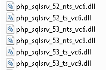
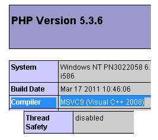
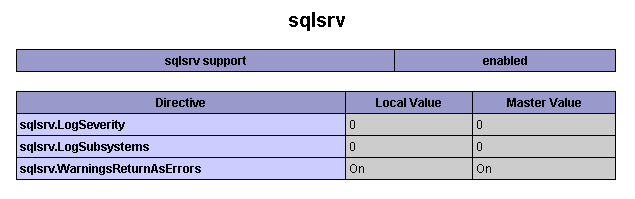
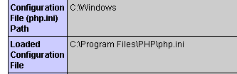
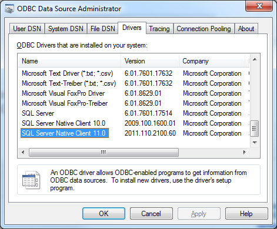
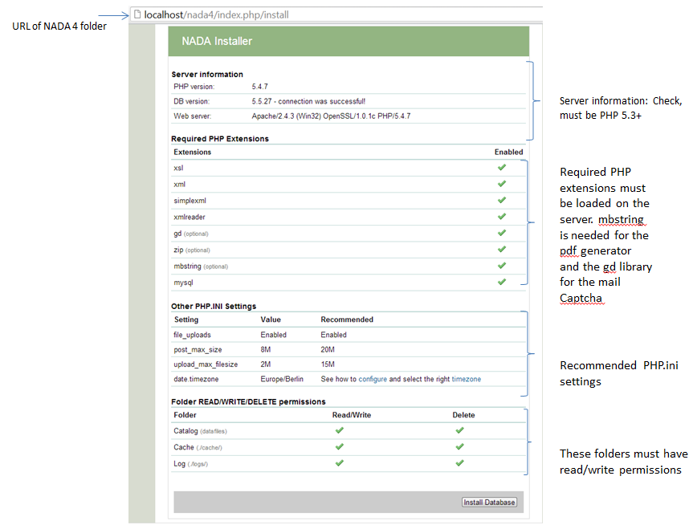
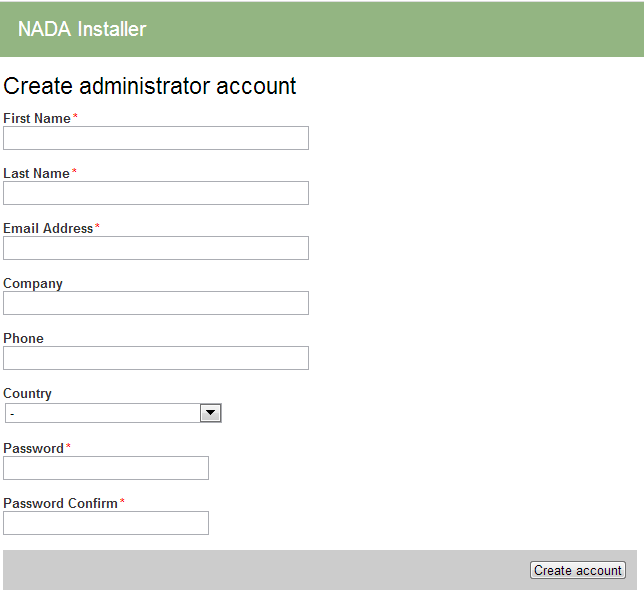
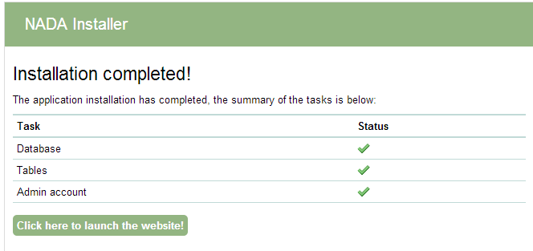

Installing NADA using Microsoft SQL Server
#########################################

PHP database drivers (sqlsrv)
------------------------------

The new Microsoft SQL drivers for PHP are called SQLSRV and provide native support for connecting to a Microsoft SQL Server database. The drivers have been tested with NADA for SQL Server 2008 and 2012.

The drivers are available for download from here: http://www.microsoft.com/en-us/download/details.aspx?id=20098

NADA Microsoft SQL Requirements
---------------------------------

To use Microsoft SQL Server database for NADA, it is recommended to use SQL Server 2008, or later, with Full-Text support enabled. The full-text engine provides faster search than the normal SQL search.

The default installation of SQL Server does not include the Full-Text engine, so before continuing on to installing NADA, please make sure you have full-text installed on your database server.

To check whether you have FULLTEXT service installed and enabled on your instance of database, run this:

	select FULLTEXTSERVICEPROPERTY('ISFULLTEXTINSTALLED');

The above statement should return a value '0' or '1'. '1' means FULLTEXT is installed.

Download drivers
----------------------

Microsoft provides two versions of the SQLSRV drivers namely version 2.0 and 3.0. NADA has only been tested with version 2.0 but should work with version 3.0. Requirements for using the drivers:

* Windows 7, Windows Server 2008 R2, Windows Server 2008 Service Pack 2, Windows Vista Service Pack 2

* PHP 5.3.6 or PHP 5.4. For information about downloading and installing PHP, visit PHP on Windows (http://windows.php.net).

* Microsoft SQL Server 2012 Native Client available in the SQL Server 2012 Feature Pack. (This is needed if database and web server are on different machines)

* Any edition of SQL Server 2005 or later.

The Microsoft SQL Client
---------------------------------

Microsoft SQL Client is required for connecting to your SQL database using NADA. The client is installed automatically if your database is hosted on the same machine as your web server. If your SQL database is running on a different machine then you must install the latest version of the SQL Client on your web server to ensure NADA can connect to your database. See section on installing Microsoft SQL Client.

How to install the SQLSRV driver for PHP
------------------------------------------

.. note::

The steps are for version 2.0 but the same applies to version 3.0

#. The drivers are available from the Microsoft website: http://www.microsoft.com/downloads/en/details.aspx?FamilyID=80e44913-24b4-4113-8807-caae6cf2ca05

#. Download the drivers and run the setup file.

#. The setup file will extract a number of .dll files to your PHP extension folder.

#. Browse to the PHP extension folder E.g. c:\php\ext.Notice there are multiple dll files included all referencing _sqlsrv. 

#. To find out which driver library is suitable for your version of PHP, create a php file using a text editor like Notepad e.g. info.php and place this code inside it: ::

	<?php phpinfo(); ?>

#. Save the file and copy it to your web server root folder. Open your web browser and type the location and name of the file e.g. info.php into your browser URL. The phpinfo() function prints your PHP version and other configuration settings for PHP. For Example: localhost/info.php. To select the right sqlsrv DLL, you'll need to know:

	* The version of PHP. E.g. 5.3
	* Which compiler is used e.g. either VC9 or VC6
	* Check whether Thread Safety is enabled or not. 

#. With the above values you would choose the file: 
	php_sqlsrv_53_nts_vc9.dll

	ts=Thread safety	
	nts=Non-thread safety

#. Once you know which dll file to use, open the php.ini file using a text editor and add the following entry at the end of your PHP.INI file. ::

	extension=php_sqlsrv_53_nts_vc9.dll

#. Save your php.ini file and restart your web server.

Testing the SQLSRV drivers and SQL Client
-------------------------

To make sure the driver/extension is installed correctly. Reload the phpinfo page and check if the extension SQLSRV is listed on the page.

If the extension is not listed on the page, recheck if the correct php.ini file has been edited. To locate the php.ini file being used by PHP look at the output of the phpinfo page in the section shown below.

This step is only required if SQL Server is not on the same server as your web server. To check if the SQL Client is already installed or not, follow the steps below:

1. Open Control Panel, Administrative Tools on your server
2. Open ODBC and switch to the tab “Drivers”

Download the Microsoft SQL Client
-----------------------------------

.. note:: 
	
	The instructions here are provided for Microsoft SQL Server 2008, if are running on a later version of Microsoft SQL Server, the latest drivers can be obtained from the Microsoft website. The installation steps are the same.

The SQL Client is available from the Microsoft website from here: http://www.microsoft.com/en-us/download/details.aspx?id=16978

Download the appropriate package for the system being used i.e. (32bit/64bit) and run the installer to install the client.

Once the client is installed, restart your computer and check again from ODBC above to confirm that the client has been installed.

NADA Database configurations for SQLSRV
-----------------------------------------

Create a database and the user account to use with NADA beforehand. The permissions need to include - create/alter tables, indexes. ( See the following reference from Microsoft for instructions on how to do this. 

* Database - http://msdn.microsoft.com/en-us/library/ms186312.aspx
* User - http://msdn.microsoft.com/en-us/library/aa337545.aspx

Open the nada database configuration file /your-nada-folder/application/config/database.php file and look for the following lines: ::

  $db['sqlsrv']['hostname'] = "localhost\sqlexpress";
  $db['sqlsrv']['username'] = "db-user-name";
  $db['sqlsrv']['password'] = "password";
  $db['sqlsrv']['database'] = "nada-database";
  $db['sqlsrv']['dbdriver'] = "sqlsrv";
  $db['sqlsrv']['dbprefix'] = "";
  $db['sqlsrv']['pconnect'] = FALSE;
  $db['sqlsrv']['db_debug'] = FALSE;
  $db['sqlsrv']['cache_on'] = FALSE;
  $db['sqlsrv']['cachedir'] = "";
  $db['sqlsrv']['char_set'] = "utf8";
  $db['sqlsrv']['dbcollat'] = "utf8_general_ci";

Fill in the database connection settings for the database created for NADA.

Save the changes.

Running the installer
---------------------

* Open a web browser to the location of the NADA installation. For example:http://your-domain/nada-folder-name, or localhost/nada-folder-name.

* If the Microsoft database connection is setup correctly, you should see the nada installer.

* Check that all settings are marked with a green tick and fix any that are not on your webserver before running the installer.

* Click on the Install Database button and complete the form to create an initial Site Administrator account. 

.. note::

	Create a complex password of atleast 12 characters long with some uppercase, punctuation and numbers to aid security of your site. Do not forget this username and password!

	
**Congratulations: Launch the new site**

