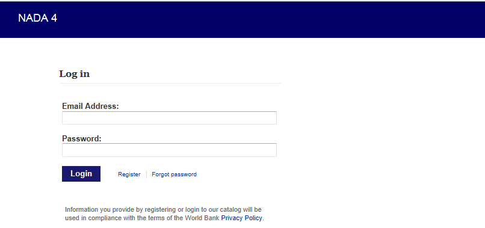
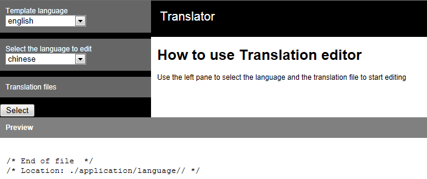
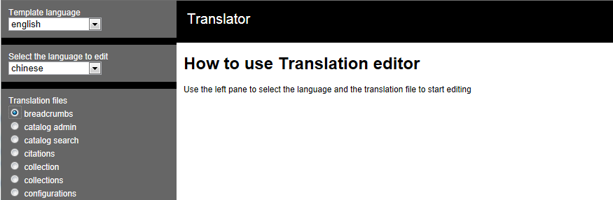
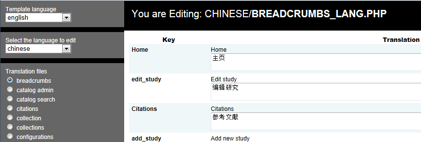
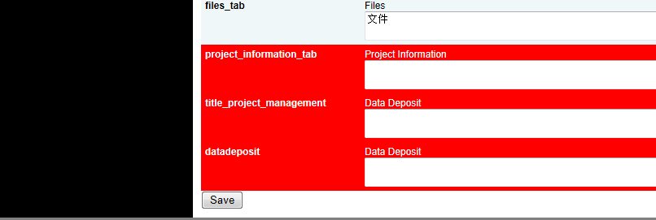
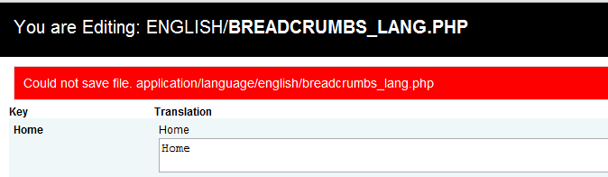

============
NADA Translation Guide
============

NADA includes a web based translation tool for updating the site’s language or creating new languages for your NADA sites. To start, you will need an admin account to manage translations.

A. Set language folder permissions:  Before you can translate, you must set the language folder to have READ/WRITE permissions. The language folder is located at: [your-nada]/application/language
B. Go to [your-nada-site]/index.php/translate. If you are not already logged in to your NADA site, you will be asked to login.

C. Choose language to edit:  “Template language” is a language that already exists in NADA and is chosen as a translation template. “Select the language to edit” is the language that you want to change with your own translations. 

-	For example, if you want to create a Chinese NADA edition and use the existing English version as a template, you will put English as the template language and Chinese as the language to edit. After picking the languages, press the Select button. 
-	In case you use English as your site language and would like to change the translations for English, choose English for both “template language” and “language to edit” drop downs.
  

D. Select  file to translate: Translation files are divided into multiple files per NADA site sections. For example, if you like to edit the translations that appear on the data catalog page, you will need to select the file “catalog search” and press the “Select” button to open the translation file for editing. The “Select” button is located at the end of the left panel. 

E. Translate file:  Fill in each field in the main panel with appropriate translations. If one field is empty, it will show in red. 

F. Roll down the page and press the Save button in the main panel. Make sure to save frequently so you won’t lose your translations by accident.

G. To make sure your changes are saved pay attention to the message box that appears after you save your changes. If you see a red box at the top of the page that means changes were not saved and usually it is caused by inefficient permissions set on the folder, make sure NADA can write to the folder to fix the error.

